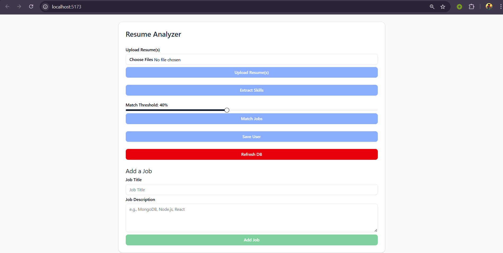
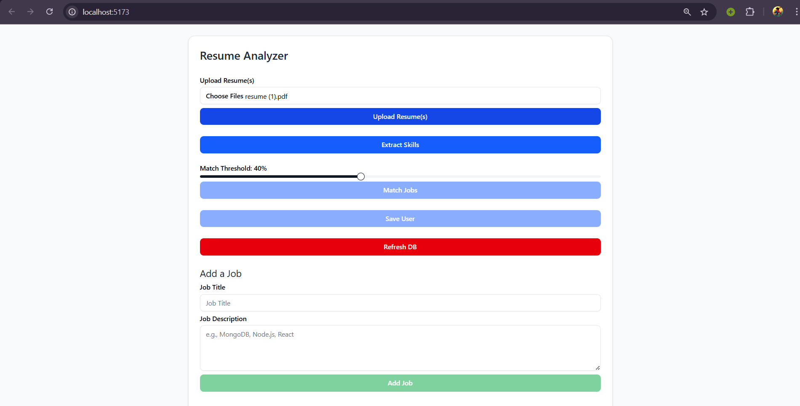
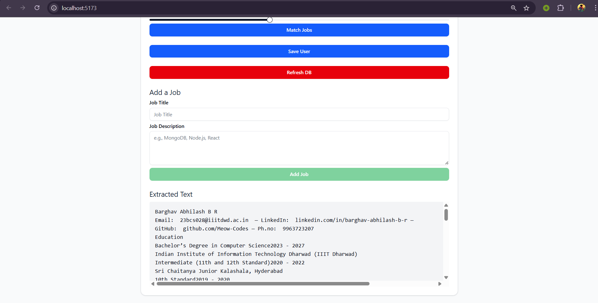
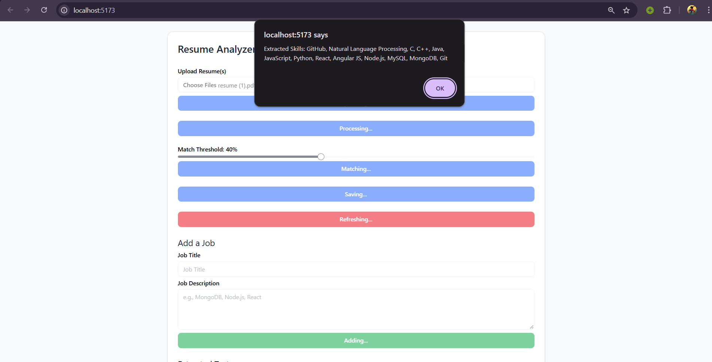
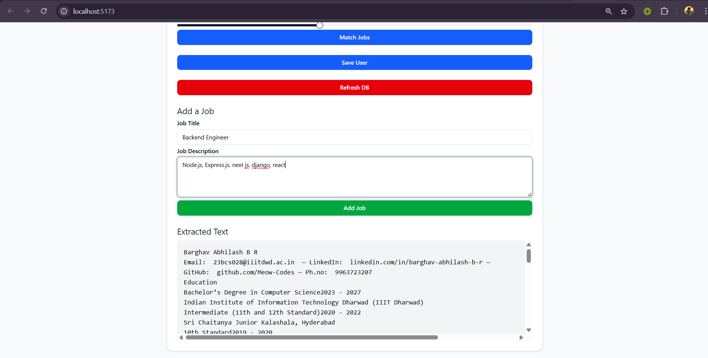
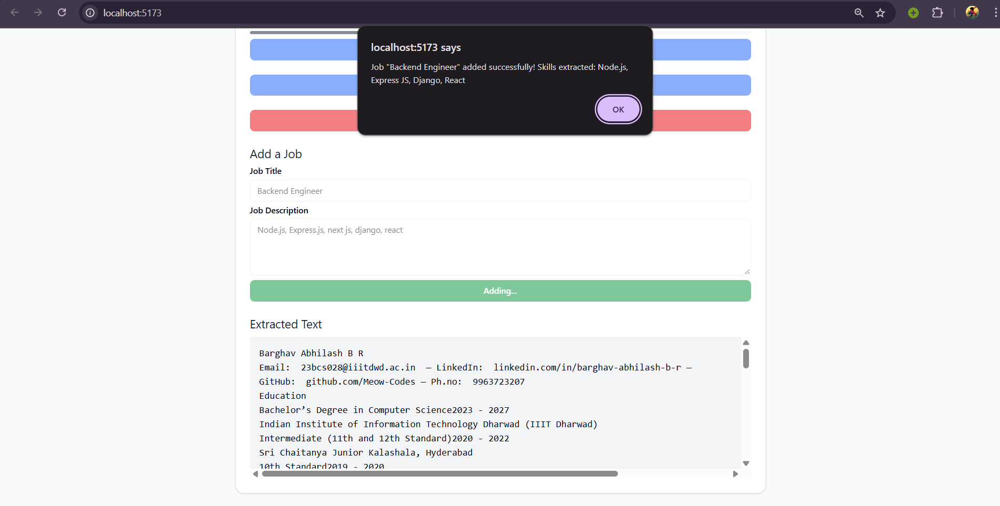
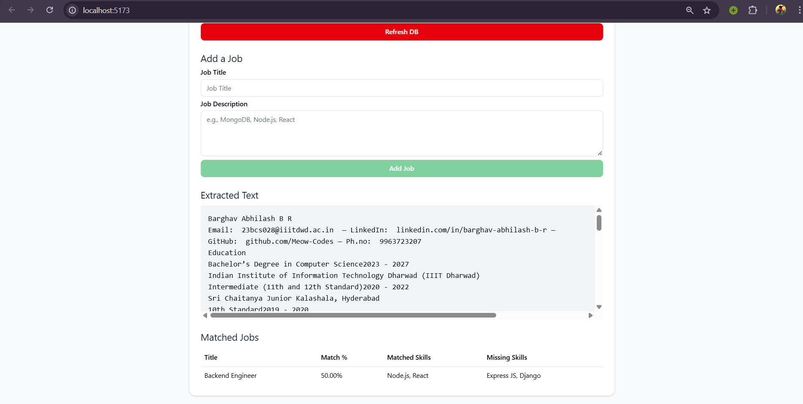
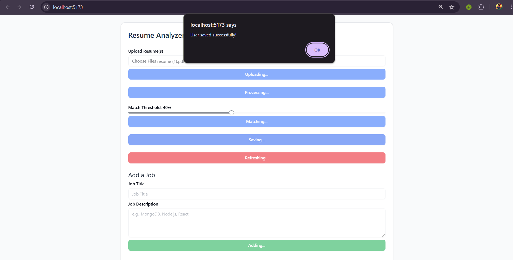
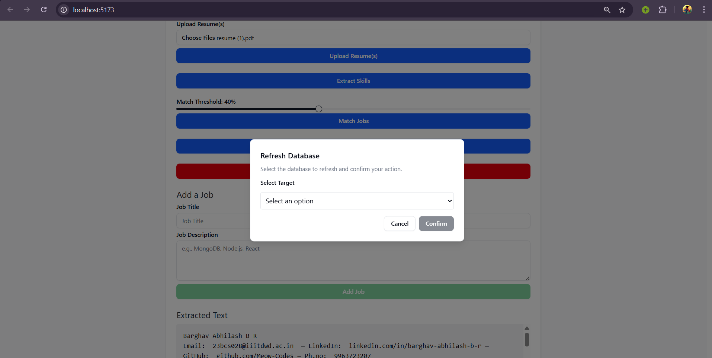
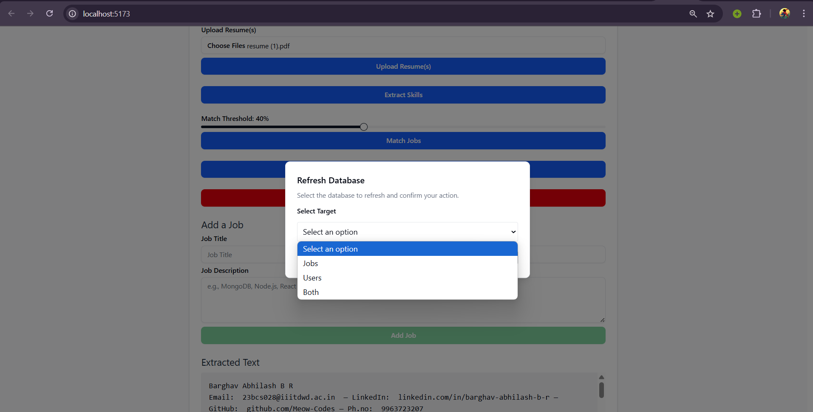

# 📄 Resume Analyser

A smart full-stack application that allows recruiters to upload resumes, analyze candidate skills, compare them with job descriptions, and receive actionable insights for better hiring decisions.

> 🚧 This project is **ongoing** and not yet deployed for full use. Snapshots are included below to demonstrate the core functionality.

---

## ✨ Key Features

- 📤 Upload resumes (PDF format)
- 🔍 Extract skills and keywords using NLP
- 📝 Upload job descriptions for matching
- 📊 Compare resumes against job requirements
- 🗃️ MongoDB used to store user and resume metadata

---

## 🧰 Tech Stack

| Technology     | Purpose                      |
|----------------|------------------------------|
| **React.js**   | Frontend UI                  |
| **React-Admin**| Admin Dashboard              |
| **Node.js**    | Backend server               |
| **Express.js** | API development              |
| **MongoDB**    | Database                     |
| **JWT**        | Authentication & Authorization |
| **Python**     | Resume parsing (optional future integration) |

---

## 🧱 Folder Structure


---

## 🖼️ Snapshots

> Screenshots show core modules of the project.

---

###  Interface



---

### 📁 Resume Upload & Parsing Page





---

### 🧠 Skill Extraction



---

---

###  Adding a Job & Matching the skills







---

###  Saving the User



---

---

###  Clearing the database





---

---

## 🚀 How to Run Locally

### 🛠 Prerequisites

- Node.js v18+
- MongoDB (local or Atlas)
- npm or yarn

### 📦 Install Dependencies

```bash
# Clone repository
git clone https://github.com/Meow-Codes/resume-analyser.git
cd resume-analyser

# Setup backend
cd backend
npm install
npm start

# Setup frontend
cd fromtend/frontend-redesign
npm install
npm run dev
